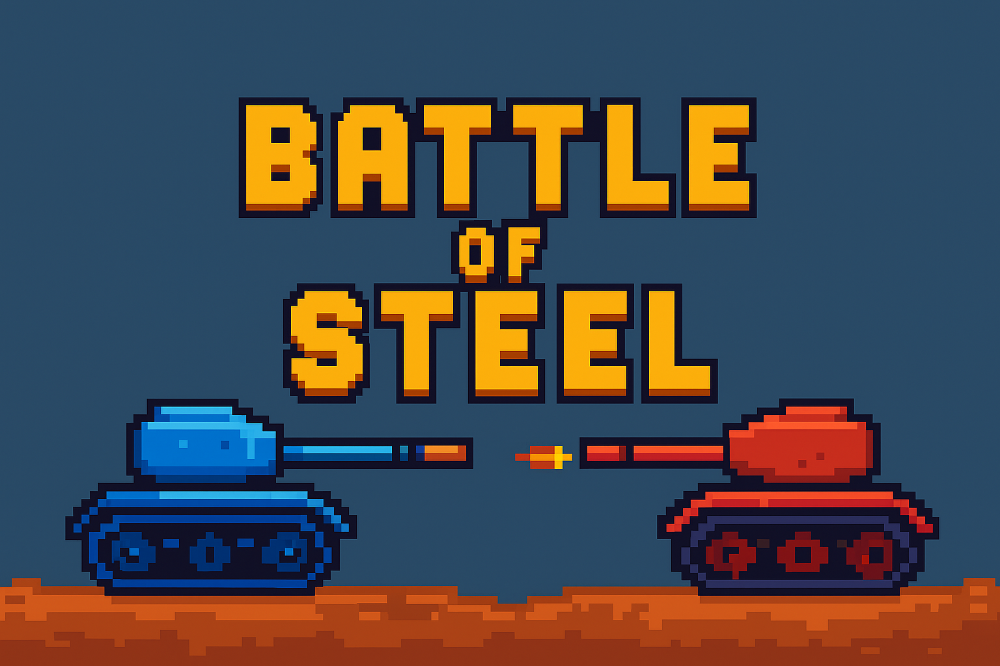
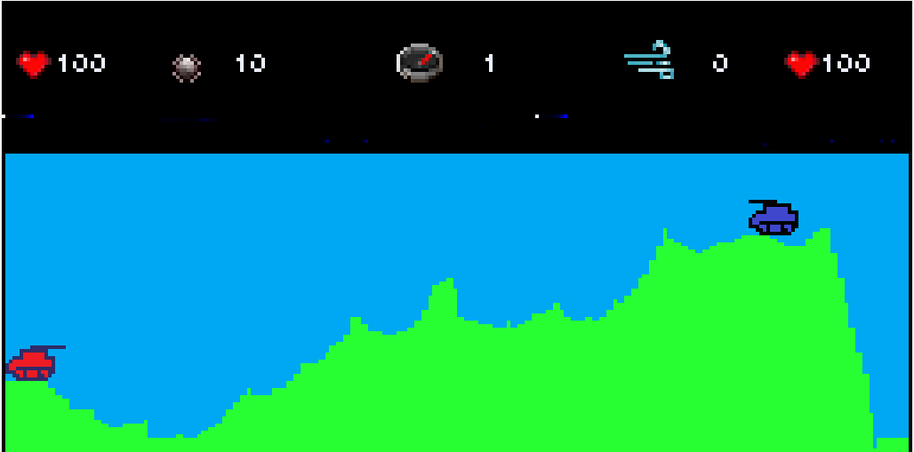
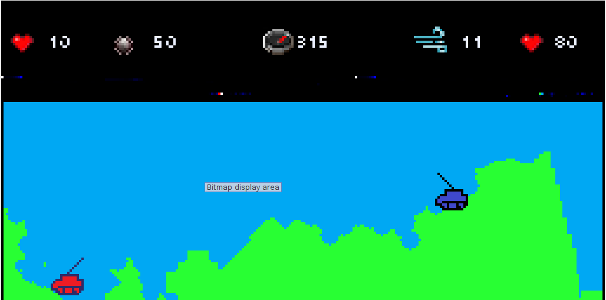
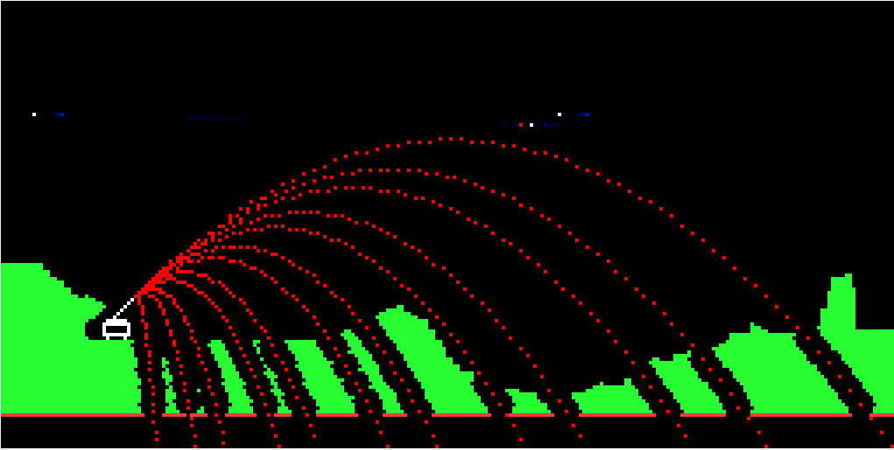
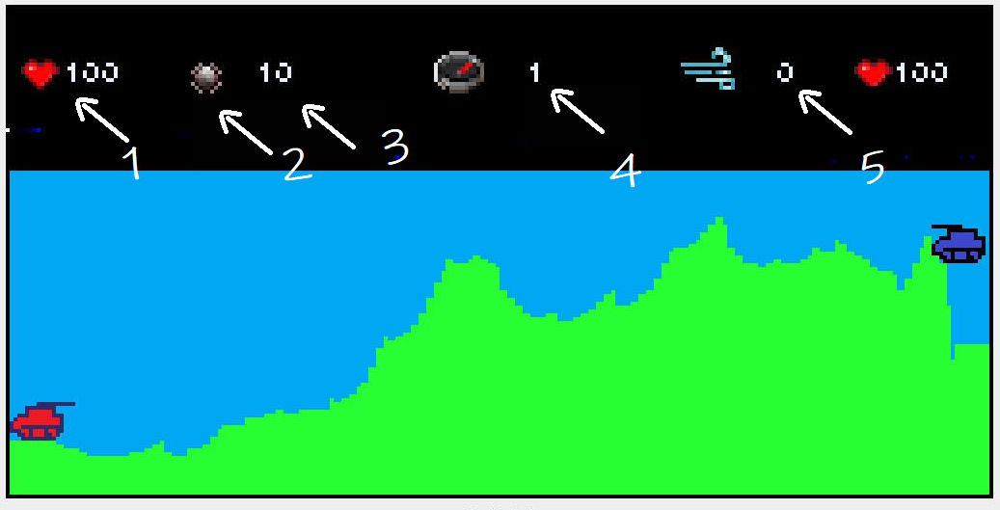

# 💣 Battle of Steel



A retro 2D tank game written in MIPS assembly for the MARS simulator.  
Inspired by Pocket Tanks and implemented entirely at low level. 💾🔥

---

## 🎮 Features

- 🌄 Random maps on every game.  
- 🤖 Two tanks facing off in strategic combat.  
- 💥 Five projectile types with different effects.  
- 🌬️ Gravity and wind affecting shots.  
- 🎯 Adjust angle and power before firing.  
- 🕹️ Local 2-player mode with keyboard controls.

---

## 🖼️ Screenshots

| Start | In-game | Projectile Impact |
|----------------|---------------------|-----------------------|
|  |  |  |

---

## 🎮 Controls

### 🔴 Tank 1
- `A` → Move back  
- `D` → Move forward  
- `W` → Raise cannon  
- `S` → Lower cannon  
- `E` → Decrease power  
- `R` → Increase power  
- `Q` → Change projectile type

### 🔵 Tank 2
- `L` → Move back  
- `J` → Move forward  
- `I` → Raise cannon  
- `K` → Lower cannon  
- `U` → Decrease power  
- `Y` → Increase power  
- `O` → Change projectile type

---



#### The figure shows the game interface

1. Red tank lives  
2. Projectile type  
3. Projectile power  
4. Wind angle  
5. Wind power

## ⚙️ Installation and Running

1. Clone the repository:  
   ```bash
   git clone https://github.com/alejandrofonsecacuza/Battle-of-Steel.git
   cd Battle-of-Steel
   ```

2. Open the file in MARS.  
3. Run the program (F5) and enjoy! 🎉

---

## 📽️ Demo

[Watch demo](docs/demo.webm)

---

## 👨‍💻 Authors

- Alejandro Fonseca Cuza  
- Juana Iris Pérez Salas  
- Álvaro de Jesús Reyes  
- Carlos Antonio Velázquez

---

## 📜 License

This project is open-source under the MIT License.
